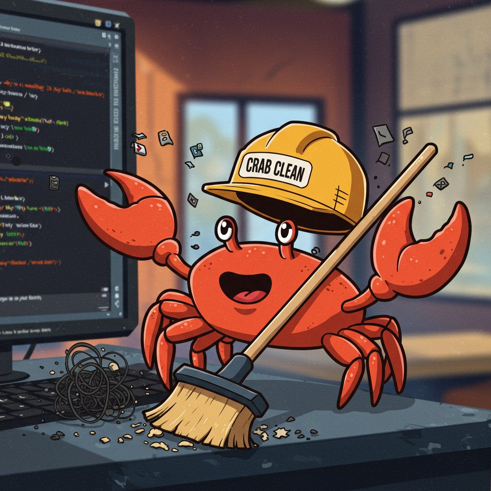

# Crab Clean

[](https://crates.io/crates/crab-clean)
[](#license)

> Crab Clean is a Rust-powered **interactive terminal UI** (built with [ratatui](https://ratatui.rs)) that helps you find and safely remove **duplicate**, **old**, and **unused** files in any directory — with rich filtering, multi-select, and recoverable trash-based deletion.

## Features

- 🖥️ **Full TUI** — no command-line flags to memorize; everything is driven from the keyboard inside the app.
- 🔍 **Duplicate detection** — exact duplicates via size bucketing + SHA-256, hashed in parallel with Rayon. Groups are shown together and all-but-the-newest is pre-selected.
- ⏳ **Old & unused files** — find files not *modified* (old) or not *accessed* (unused) for N days.
- 🗂️ **Browse-all mode** — list every file and narrow it down with filters.
- 🎛️ **Powerful filters** — by extension, name substring, size range, and date range (`YYYY-MM-DD`).
- ✅ **Multi-select** — mark individual files, select all / clear / invert, sort by name/size/date/extension.
- 🗑️ **Safe by default** — deletions go to the OS trash (recoverable). Toggle to permanent per-action. Empty the system trash from inside the app.
- 🪟 **Modal UI** — confirm, settings, filters, and help are centered dialogs over a dimmed background; the focused panel is always highlighted.
- ⌨️ **Vim mode** — optional `hjkl` / `gg` / `G` navigation, toggleable in Settings and persisted.
- ⚙️ **Customizable** — an in-app Settings dialog plus a TOML config for default path, scan depth, hidden/symlink handling, default age, time basis, delete mode, color theme (Default / Ocean / Sunset / Mono), and vim mode.
- ⚡ **Responsive** — scanning and hashing run on a background thread (with an animated spinner) so the UI never freezes.

## Installation

### From crates.io

```bash
cargo install crab-clean
```

### From source

```bash
git clone https://github.com/adithya-adee/crab-clean.git
cd crab-clean
cargo install --path .
```

This installs the `crabclean` binary onto your `PATH` (`~/.cargo/bin`).

## Usage

Just launch it — there are no subcommands or flags:

```bash
crabclean
```

You land on the **Home** screen, which has three panels — **Mode**, **Browse**, and **Options**. The focused panel is highlighted with a bold accent border so you always know where you are. `Tab` cycles between panels. There's no path to type: navigate to the folder you want with the built-in directory browser, then press `s` to scan it.

### Key bindings

**Home** (`Tab` switches panel)

| Key | Action |
| --- | --- |
| `Tab` / `Shift-Tab` | Switch panel (Mode → Browse → Options) |
| `↑` / `↓` | Move within the focused panel |
| `Enter` / `→` | (Browse) open the highlighted folder |
| `←` / `Backspace` | (Browse) go up one folder |
| `~` | (Browse) jump to your home directory |
| `←` / `→` / digits | (Options) adjust age / max-depth |
| `Space` | (Options) toggle include-hidden / follow-symlinks |
| `s` | Scan the current folder |
| `e` | Empty the system trash |
| `,` | Open Settings (vim mode, theme, …) |
| `F1` / `?` | Help (works anywhere) |
| `Esc` | Quit |

> Enable **Vim mode** in Settings (`,`) for `hjkl` movement, `gg`/`G` to jump to top/bottom, `/` to filter, and `x` to mark. Arrow keys keep working in both modes.

**Review**

| Key | Action |
| --- | --- |
| `↑`/`↓` or `j`/`k` | Move cursor |
| `Space` | Mark / unmark a file for deletion |
| `a` / `c` / `i` | Select all / clear / invert |
| `f` / `F` | Open filters / reset filters |
| `s` / `S` | Cycle sort key / flip direction |
| `g` / `G` | Jump to top / bottom |
| `d` or `Enter` | Review & delete the marked files |
| `q` / `Esc` | Back to Home |

**Confirm**

| Key | Action |
| --- | --- |
| `t` | Toggle Trash ↔ Permanent |
| `y` / `Enter` | Delete |
| `n` / `Esc` | Cancel |

## Configuration

Crab Clean reads an optional TOML file (defaults are used if it's absent):

- Linux: `~/.config/crab-clean/config.toml`
- macOS: `~/Library/Application Support/crab-clean/config.toml`
- Windows: `%APPDATA%\crab-clean\config.toml`

```toml
default_path = "."
max_depth = 8            # omit / null for unlimited
include_hidden = false
follow_symlinks = false
default_age_days = 30
time_basis = "Modified"  # Modified | Accessed | Created  (used by date filters)
delete_mode = "Trash"    # Trash | Permanent
theme = "Default"        # Default | Ocean | Sunset | Mono
vim_mode = false         # hjkl / gg / G navigation
```

Most of these can also be changed live from the in-app **Settings** dialog (`,`), which saves them back to this file on close.

## Safety

- **Trash by default** — files go to your OS recycle bin and can be restored. Permanent deletion is opt-in per action.
- **Explicit confirmation** — nothing is deleted until you review the exact list and confirm.
- **Robust scanning** — unreadable files/dirs are skipped instead of crashing the scan.

## Library use

The detection logic is also usable as a library:

```rust
use crab_clean::core::scanner::{scan, ScanOptions};
use crab_clean::core::algorithms::find_duplicates;
use std::path::Path;

let files = scan(Path::new("."), &ScanOptions::default(), |_| {}).unwrap();
let groups = find_duplicates(&files);
println!("found {} duplicate group(s)", groups.len());
```

## License

Licensed under either of

- Apache License, Version 2.0 ([LICENSE-APACHE](LICENSE-APACHE))
- MIT license ([LICENSE-MIT](LICENSE-MIT))

at your option.

## Changelog

See [CHANGELOG.md](CHANGELOG.md).
